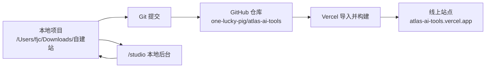
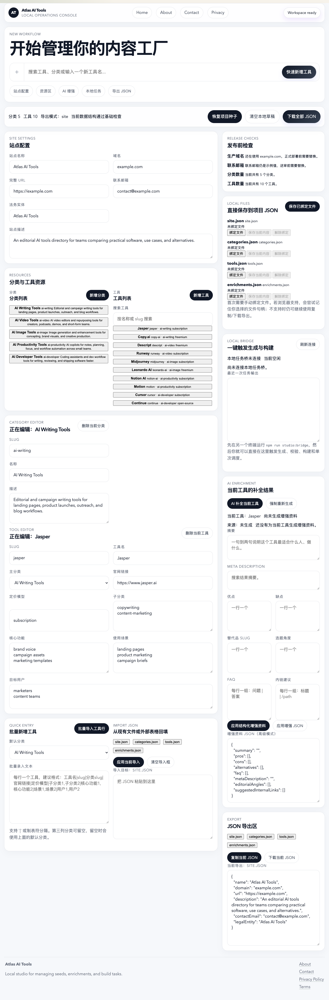
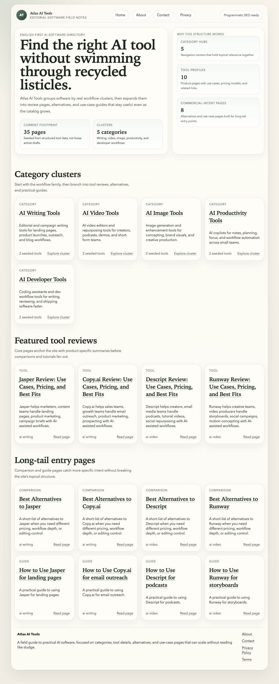

# Vercel 部署与后续维护手册

当前项目：
- GitHub 仓库：[one-lucky-pig/atlas-ai-tools](https://github.com/one-lucky-pig/atlas-ai-tools)
- 当前线上地址：[atlas-ai-tools.vercel.app](https://atlas-ai-tools.vercel.app)
- 本地项目目录：`/Users/fjc/Downloads/自建站`

## 总览



## 一、第一次部署步骤

### 1. 本地准备

实际截图：



1. 进入项目目录：

```bash
cd /Users/fjc/Downloads/自建站
```

2. 确认站点基本信息：
- [data/site.json](/Users/fjc/Downloads/自建站/data/site.json:1)
- [.env.example](/Users/fjc/Downloads/自建站/.env.example:1)

当前已经设置：
- 联系邮箱：`qdfjc2020@gmail.com`
- 默认线上域名：`https://atlas-ai-tools.vercel.app`

3. 本地先构建一次：

```bash
npm run build
```

如果这一步通过，说明项目可以交给 Vercel 构建。

### 2. 初始化 Git 并推到 GitHub

这部分已经完成过一次，标准流程如下：

```bash
git init
git add .
git commit -m "Initial studio site factory"
git remote add origin git@github.com:one-lucky-pig/atlas-ai-tools.git
git push -u origin main
```

如果 GitHub 没有配置 SSH Key，需要先把本机公钥加入 GitHub：

```bash
cat ~/.ssh/id_rsa.pub
```

然后去 GitHub：
- `Settings`
- `SSH and GPG keys`
- `New SSH key`

把公钥粘进去保存。

实际截图：


### 3. 在 Vercel 导入现有仓库

1. 打开 [vercel.com/new](https://vercel.com/new)
2. 选择 `Import Project`
3. 如果列表没及时出现仓库，可以直接在顶部输入框粘这个地址：

```text
https://github.com/one-lucky-pig/atlas-ai-tools
```

4. 第一次连接 GitHub 时，Vercel 会要求安装 GitHub App
5. 安装完成后，重新回到导入页
6. 确认以下配置：
- Repository：`one-lucky-pig/atlas-ai-tools`
- Project Name：`atlas-ai-tools`
- Application Preset：`Astro`
- Root Directory：`./`

7. 点击 `Deploy`

### 4. 一个重要的避坑点

如果 Vercel 中途跳到类似下面这种页面：

- `Create a Git repository to easily update your project...`
- `Private Repository Name`

说明它走偏到了“额外创建一个仓库源”的流程。

**正确做法：**
- 不要继续创建 `atlas-ai-tools-vercel` 这种额外项目
- 回退
- 重新用“导入现有 GitHub 仓库”的方式导入

### 5. 当前这次实际发生过的问题

Vercel 第一次构建失败的原因是：

```text
Could not resolve "../../data/generated/enrichments.json"
```

已经修复，修复提交是：
- `9adc0d5 Ensure enrichments cache exists during build`

这个修复保证了：
- 就算没有模型配置
- 就算 `data/generated/enrichments.json` 一开始不存在
- `npm run generate` 也会自动生成空文件，Vercel 构建不会再因为它缺失而失败

### 6. 部署成功后

成功后 Vercel 会给你一个免费地址：
- [atlas-ai-tools.vercel.app](https://atlas-ai-tools.vercel.app)

现在这个地址已经是项目默认线上地址。

实际截图：



## 二、后续怎么维护和上传

后续维护分为两类：

### 1. 维护内容

你可以用本地后台：
- `http://127.0.0.1:4321/studio`

启动方式：

```bash
cd /Users/fjc/Downloads/自建站
npm run dev
```

如果要启用本地任务桥和 AI 补全：

```bash
npm run studio:bridge
```

在 `/studio` 里你可以：
- 改站点配置
- 改分类和工具
- 批量录入工具
- 导入/导出 JSON
- 生成增强资料
- 直接保存到本地 JSON

### 2. 维护代码并重新上线

标准步骤如下：

```bash
cd /Users/fjc/Downloads/自建站
npm run build
git status
git add .
git commit -m "你的修改说明"
git push
```

一旦 `git push` 成功：
- Vercel 会自动检测到 `main` 分支更新
- 自动重新构建
- 自动重新部署

也就是说，后期你只要记住一句话：

> 本地改完，`git push`，Vercel 自动更新

## 三、推荐的后续维护顺序

### 日常改内容

1. 打开 `/studio`
2. 修改内容
3. 保存回本地 JSON
4. 本地构建：

```bash
npm run build
```

5. 提交并推送：

```bash
git add .
git commit -m "Update content"
git push
```

### 改站点功能或样式

1. 修改代码
2. 本地构建：

```bash
npm run build
```

3. 提交并推送：

```bash
git add .
git commit -m "Refine studio UI"
git push
```

## 四、你现在最重要的几个入口

### 本地后台

```text
http://127.0.0.1:4321/studio
```

### 线上站点

[https://atlas-ai-tools.vercel.app](https://atlas-ai-tools.vercel.app)

### GitHub 仓库

[one-lucky-pig/atlas-ai-tools](https://github.com/one-lucky-pig/atlas-ai-tools)

## 五、补充提醒

1. `atlas-ai-tools.vercel.app` 现在适合先跑通流程
2. 如果以后要更正式，再绑定你自己的 `fjc.zone`
3. 如果要上 `AdSense / GSC`，建议后面再补：
- `ads.txt`
- GSC 验证
- Analytics/gtag
- 自有域名

## 六、一句话版

### 第一次部署

> 本地构建通过 → 推 GitHub → Vercel 导入现有仓库 → 成功拿到 `vercel.app`

### 后续维护

> 本地改内容/代码 → `npm run build` → `git push` → Vercel 自动更新
